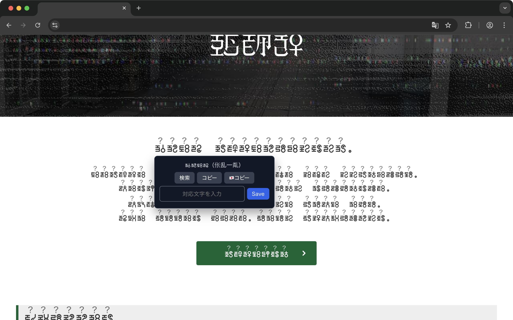

# Okechika Helper



桶地下文字の解読作業を支援するためのブラウザ拡張です。

## 主な機能

- 対象サイト上の桶地下文字にルビを表示
- テキスト選択から tooltip で解読テーブルを更新
- tooltip から選択文字列のコピー、デコード結果のコピー、サイト内検索を実行
- 解読テーブルの CSV インポート / エクスポート
- 管理ページで桶地下文字一覧、相互変換、ブックマークを管理
- 対象ルート URL の管理（追加・削除・初期化）

## 入力ルール

- 桶地下文字を 1 文字だけ選択している場合は、任意の長さの文字列を 1 つの対応として登録できます
- 桶地下文字を複数選択している場合は、入力文字数を選択文字数と一致させる必要があります

詳細仕様は [docs/SPEC.md](docs/SPEC.md) を参照してください。

## 技術スタック

- WXT
- React
- TypeScript

## セットアップ

```bash
npm install
```

## 開発コマンド

```bash
# 開発起動
npm run dev

# 本番ビルド
npm run build

# 配布用 zip 生成
npm run zip

# 型チェック
npm run typecheck

# lint
npm run lint

# format check
npm run format:check
```

## ローカルで拡張を確認する

1. `npm run build` を実行
2. Chrome の `chrome://extensions` を開く
3. 「デベロッパーモード」を ON
4. 「パッケージ化されていない拡張機能を読み込む」で `.output/chrome-mv3` を選択

## リリース時の注意

Chrome Web Store への submit に失敗した場合の再実行方法は、失敗した段階で分かれます。

- ZIP のアップロード前に失敗した場合は、Developer Dashboard や認証情報を修正したあと、通常どおり `Release Extension` workflow を再実行します。
- ZIP のアップロード後に失敗した場合は、Developer Dashboard 側の追加作業を済ませたあと、`Release Extension` workflow を `skip_submit=true` で再実行します。このモードでは `wxt submit` をスキップし、release commit / tag / GitHub release 作成など残りの処理だけを再実行します。

## 権利について

- 桶地下は第四境界のコンテンツです
- 本拡張機能はファンメイド作品であり、第四境界とは関係がなく、権利を侵害する意図はありません

関連リンク:

- 第四境界: https://www.daiyonkyokai.net/
- 桶地下 調査の手引き: https://www.daiyonkyokai.net/bps/guide/78fghuvtgy7/
